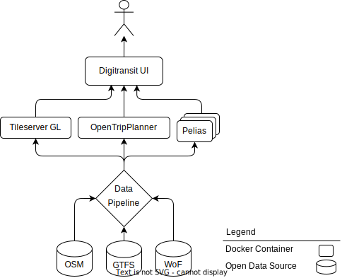
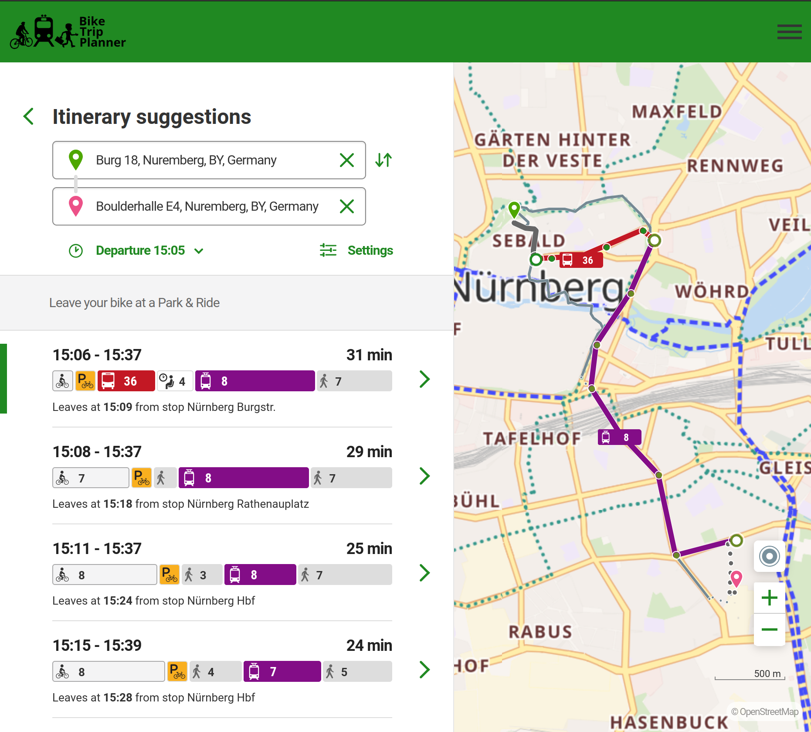
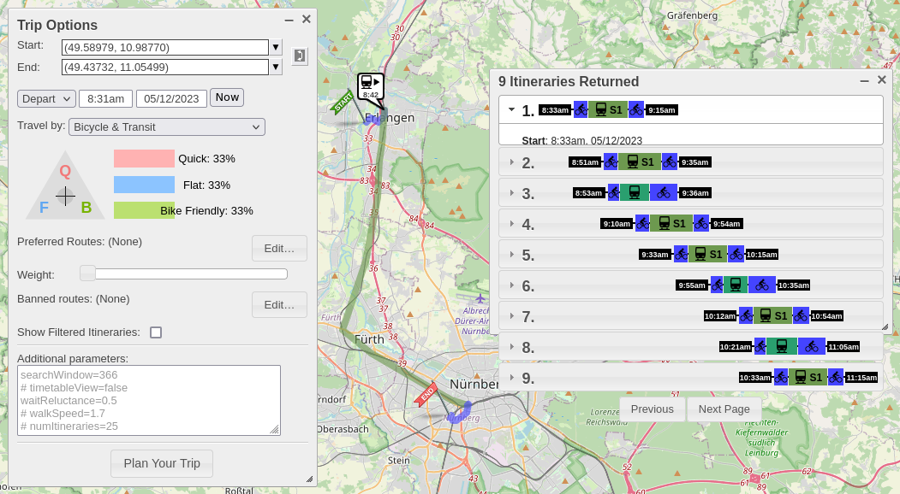
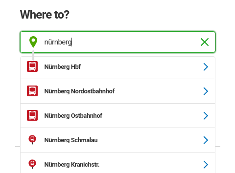
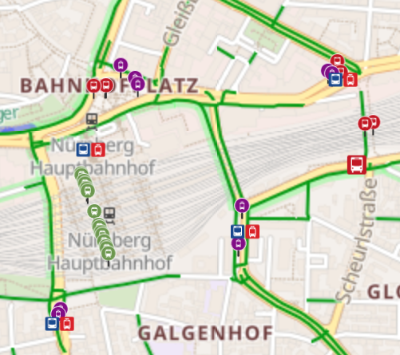
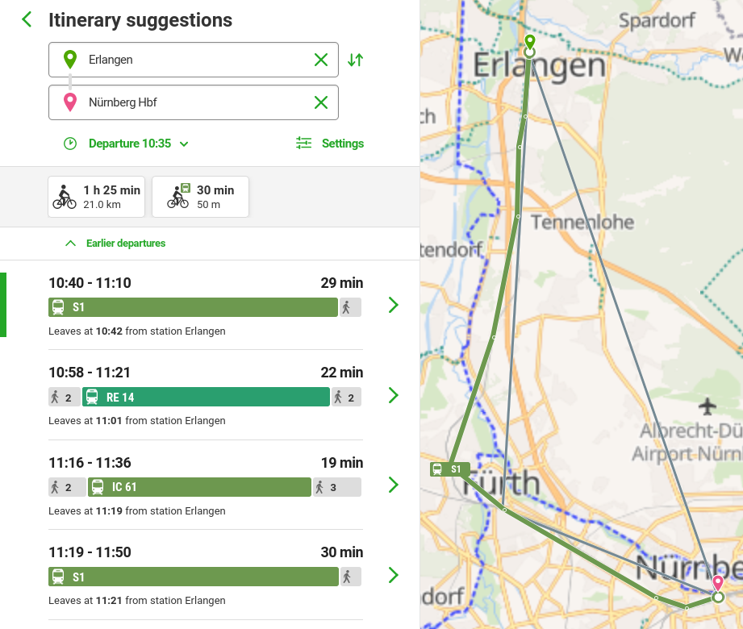

# BikeTripPlanner

A multimodal journey planner that is built on open source components and is powered by open data.

Configuration for another region with different data sources is possible through a single `.env` file.
Using Docker Compose, the project can be run locally or publicly accessible through a domain with automatic HTTPS certificate generation.

The core components are [Digitransit UI](https://github.com/HSLdevcom/digitransit-ui) (web frontend), [OpenTripPlanner](https://github.com/opentripplanner/OpenTripPlanner) (multimodal router), [Pelias](https://github.com/pelias/pelias) (geocoder), [tilemaker](https://github.com/systemed/tilemaker) (map generation), [Tileserver GL](https://github.com/maptiler/tileserver-gl) (map server) and [nginx-proxy](https://github.com/nginx-proxy/nginx-proxy) (reverse proxy and HTTPS certificates). Data sources are a GTFS feed (for scheduled public transit data), [OpenStreetmap](https://osm.org) (for road network and address data) and [Who's On First](https://whosonfirst.org/) (for places and their hierarchy).



**TLDR**:
* Configuration is done in [.env](.env).
* Run `make build` to build all Docker images.
* Thereafter, run `make test` to check if the built containers start healthy or `make start` to keep the local instance running.
* Optionally, use `make publish` to upload the Docker images into a registry.
* Lastly, see [Deployment](#deployment) for detains on making your BikeTripPlanner instance publicly available under a domain and with HTTPS certificates.

## Demo

A demo instance covering the area of the German transport association
VGN is available at [https://biketripplanner.de/](https://biketripplanner.de/).

[](screenshot-nuremberg-bike-and-ride.png)

## Configuration

Go through [.env](.env) and adjust the values as desired.

Important parts are:
- Bounding box describing a rectangular geographical area.
- Link to OpenStreetMap region covering the bounding box.
- Link to GTFS feed providing transit data.
- Requests to the individual services that are used for Docker container healthchecks. If the OpenStreetMap or GTFS data sources are changed, these need to be adjusted as well.

In addition to the default configuration for the area of the VGN transport association, there is a `.env` file for [Finland](examples/finnland/.env). Just overwrite [.env](.env) with it to give it a try.

For advanced configuration, see:
- [opentripplanner/README.md](opentripplanner/README.md)
- [pelias/README.md](pelias/README.md)

## Build data images

Prerequisites: Install Docker Compose, `jq`, `sudo` and optionally `make`.

The following sections provide additional information about the individual build steps. There is also a [Makefile](Makefile) to accomplish the same.

### GTFS data

#### 1) gtfs-data

First, download the GTFS data set:

```shell
sudo docker compose -f build-data.yml build --progress=plain --pull gtfs-data
```

#### 2) gtfs-modified

If desired, the GTFS feed can be modified: Add or change the `bikes_allowed` column, delete files from the GTFS feed or fix unescaped double-quotes.

```shell
sudo docker compose -f build-data.yml build --progress=plain gtfs-modified
```

This step is optional and kan be skipped with:

```shell
sudo docker tag build-gtfs-data build-gtfs-modified
```

#### 3) gtfs-filter

If desired, the GTFS feed can be filtered to the bounding box: Only routes (and all linked data) that reside inside the or intersect with the bounding box are kept.

```shell
sudo docker compose -f build-data.yml build --progress=plain gtfs-filtered
```

This step is optional and kan be skipped with:

```shell
sudo docker tag build-gtfs-modified build-gtfs-filtered
```

### OSM data

#### 1) osm-data

```shell
sudo docker compose -f build-data.yml build --progress=plain --pull osm-data
```

#### 2) osm-excerpt

```shell
sudo docker compose -f build-data.yml build --progress=plain --pull osmium-tool
sudo docker compose -f build-data.yml build --progress=plain osm-excerpt
```

#### 3) osm-filtered

```shell
sudo docker compose -f build-data.yml build --progress=plain --pull osmium-tool
sudo docker compose -f build-data.yml build --progress=plain osm-filtered
```

### DEM data

Download DEM tiles.

```shell
sudo docker compose -f build-data.yml build --progress=plain --pull dem-data
```

Merge tiles into one DEM file.

```shell
sudo docker compose -f build-data.yml build --progress=plain dem-merged
```

View credits.

```shell
sudo docker compose -f build-data.yml run --rm dem-merged cat /data/credits.json
```

### Background map (Tileserver GL)

```shell
sudo docker compose -f build-tilemaker.yml build --progress=plain --pull tilemaker
# Don't `--pull` as we are using the previously built `tilemaker`.
sudo docker compose build --progress=plain tileserver-gl
```

### Routing (OpenTripPlanner)

```shell
# Build final OpenTripPlanner container.
# Don't `--pull` as we are using the previously built `osm-excerpt`.
sudo docker compose build --progress=plain opentripplanner
```

### Geocoder (Pelias)

```shell
# Set shell variables from `.env`.
export "$(grep '^BUILD_NAME=' < .env)"
export "$(grep '^PELIAS_BUILD_DIR=' < .env)"
export "$(grep '^COUNTRY_CODE=' < .env)"
export "$(grep '^WOF_IDS=' < .env)"

# Change `countryCode` in pelias.json file.
pelias_json="$(cat "${PELIAS_BUILD_DIR}/pelias.json")"
if [ "${COUNTRY_CODE}" = "" ]; then
  # Delete `countryCode`
  jq 'del(.imports.whosonfirst.countryCode)' <<< "${pelias_json}" > "${PELIAS_BUILD_DIR}/pelias.json"
else
  # Set `countryCode`
  jq ". | .imports.whosonfirst.countryCode=\"${COUNTRY_CODE}\"" <<< "${pelias_json}" > "${PELIAS_BUILD_DIR}/pelias.json"
fi

# Change `importPlace` in pelias.json file.
pelias_json="$(cat "${PELIAS_BUILD_DIR}/pelias.json")"
if [ "${WOF_IDS}" = "" ]; then
  # Delete `importPlace`
  jq 'del(.imports.whosonfirst.importPlace)' <<< "${pelias_json}" > "${PELIAS_BUILD_DIR}/pelias.json"
else
  # Set `importPlace`
  jq --argjson wof_ids "${WOF_IDS}" '. | .imports.whosonfirst.importPlace=$wof_ids' <<< "${pelias_json}" > "${PELIAS_BUILD_DIR}/pelias.json"
fi

# Create temporary Pelias data directory.
mkdir -p "${PELIAS_BUILD_DIR}/data/"{elasticsearch,openstreetmap,gtfs}
# Start Elasticsearch and wait until healthy.
sudo docker compose -f build-pelias.yml up -d --wait elasticsearch
# Initialize Elasticsearch.
sudo docker compose -f build-pelias.yml run --rm schema ./bin/create_index
# Download, prepare and import data:
sudo docker run --rm --entrypoint cat ${BUILD_NAME}-osm-excerpt /data/osm.pbf > "${PELIAS_BUILD_DIR}/data/openstreetmap/osm.pbf"
sudo docker run --rm --entrypoint cat ${BUILD_NAME}-gtfs-filtered   /data/gtfs.zip        > "${PELIAS_BUILD_DIR}/data/gtfs/gtfs.zip"
sudo docker compose -f build-pelias.yml run --rm whosonfirst   ./bin/download

# The Pelias Docker-Compose helper script uses the following command:
#   sudo docker compose -f build-pelias.yml run --rm polylines     ./docker_extract.sh
# But this complains about a too large OSM file (e.g. of whole Germany).
# Thus, we use another tool to generate polylines:
sudo docker compose -f build-pelias.yml build --pull polylines-gen
sudo docker compose -f build-pelias.yml run --rm polylines-gen

sudo docker compose -f build-pelias.yml run --rm placeholder   ./cmd/extract.sh
sudo docker compose -f build-pelias.yml run --rm placeholder   ./cmd/build.sh
sudo docker compose -f build-pelias.yml run --rm interpolation ./docker_build.sh
sudo docker compose -f build-pelias.yml run --rm whosonfirst   ./bin/start
sudo docker compose -f build-pelias.yml run --rm openstreetmap ./bin/start
sudo docker compose -f build-pelias.yml run --rm polylines     ./bin/start
sudo docker compose -f build-pelias.yml build --pull gtfs
sudo docker compose -f build-pelias.yml run --rm gtfs          ./bin/start

# Stop and remove intermediate containers.
sudo docker compose -f build-pelias.yml down
# Build final Pelias containers.
sudo docker compose build --progress=plain api libpostal placeholder interpolation pip elasticsearch
# Remove temporary data directory.
#sudo rm -r "${PELIAS_BUILD_DIR}/data"
```

### Web UI (Digitransit-UI)

```shell
sudo docker compose build --progress=plain --pull digitransit-ui
```

## Test on local machine

### Startup

Start all services and wait for them to be healthy:

```shell
sudo docker compose up -d --wait
```

If this fails, you may need to adjust the healthcheck configuration.

### View healthcheck output

If a container is unhealthy, the first 4096 bytes of the healthcheck output can be viewed with:

```shell
CONTAINER=libpostal && \
CONTAINER_ID="$(sudo docker compose ps -q "${CONTAINER}")" && \
sudo docker inspect "${CONTAINER_ID}" | jq '.[].State.Health.Log[].Output'
```

Additional information: https://docs.docker.com/engine/reference/builder/#healthcheck

### Interactive testing

In addition to the container healthchecks, you can do the following:

* Background map: Open http://localhost:7070 and test if the vector and raster maps look as expected.
* Routing: Open http://localhost:8080
  * Use right-click to set start and end points on the map.
  * Change `travel by` to one of the bicycle modes, e.g. `Bicycle & Transit`, then press `Plan your Trip`. If there is only a direct bicycle connection, your GTFS data might be missing the `bikes_allowed` field.
    * 
* Web UI: Open http://localhost:9090
  * Test if searching for addresses and places works.
    * 
  * Is the stop and station map overlay visible?
    * 
  * Test if navigation works on.
    * For the VGN, opening this link will search for journeys in Nuremberg: http://localhost:9090/reitti/Erlangen%3A%3A49.596018%2C11.001793/N%C3%BCrnberg%20Hbf%3A%3A49.446369%2C11.081806
    * 

### Shutdown

```shell
sudo docker compose down
```

## Deployment

### Publish images

Tag and push the locally built images to a docker container registry:

```shell
./publish.sh
```

### Run with Docker Compose

In [deployment](deployment), there are two Docker Compose examples.

#### Nginx reverse proxy with Let's Encrypt certificates

This example includes an nginx server that receives HTTPS requests from the Internet and proxies them to the corresponding services via HTTP. Certificate creation and renewal is automated using Let's Encrypt.

```
                                        Docker Compose
                               ┌──────────────────────────────┐
                               │                              │
                               │            ┌─►Tileserver GL  │
┌─────────┐                    │            │                 │
│         │HTTPS          HTTPS│        HTTP├─►OpenTripPlanner│
│ Client◄─┼─────►Internet◄─────┼─►nginx◄────┤                 │
│         │                    │            ├─►Pelias API     │
└─────────┘                    │            │                 │
                               │            └─►Digitransit-UI │
                               │                              │
                               └──────────────────────────────┘
```

Create one domain for the UI and three subdomains for the background map, geocoder and routing services. All four domains have to point to the server intended for running BikeTripPlanner. Also, make sure that the ports 80 and 443 are opened and reachable over the Internet.

Set the domain values in [deployment/.env](deployment/.env) accordingly.

Then start your BikeTripPlanner instance with:

```shell
cd deployment
sudo docker compose -f btp-and-proxy.yml up -d --wait
```

#### Load distribution

As the Pelias and OpenTripPlanner services are quite RAM and CPU intensive, one might want to run some of the Docker containers on different servers to spread the load or even introduce load balancing of e.g. routing requests over multiple OpenTripPlanner instances.

This second example gives an overview how the large Docker Compose project can be split up into smaller parts, each of which run on a different server.

Separating the background map, routing, geocoding and UI services is as easy as copying the corresponding services from the [deployment/btp-and-proxy.yml](deployment/btp-and-proxy.yml) Docker Compose file into separate files and removing the `depends_on` statements of services that are no longer part of the same Docker Compose file. It is thereafter the users responsibility to start the Docker Compose projects in the correct order (e.g. starting the UI project last).

As we want to keep this example simple, we leave it up to the user which of the services named above they want to separate and keep them all in one Docker Compose project. But we lay the foundation to fine granular load distribution and load balancing by introducing a dedicated reverse proxy server which removes the CPU load of encrypting and decrypting HTTPS connections away from the BikeTripPlanner services.

```
                                                       Docker Compose
                                              ┌──────────────────────────────┐
                                              │                              │
                              Docker Compose  │            ┌─►Tileserver GL  │
┌─────────┐                    ┌─────────┐    │            │                 │
│         │HTTPS          HTTPS│         │HTTP│        HTTP├─►OpenTripPlanner│
│ Client◄─┼─────►Internet◄─────┼─►nginx◄─┼────┼─►nginx◄────┤                 │
│         │                    │         │    │            ├─►Pelias API     │
└─────────┘                    └─────────┘    │            │                 │
                                              │            └─►Digitransit-UI │
                                              │                              │
                                              └──────────────────────────────┘
```

Create one domain for the UI and three subdomains for the background map, geocoder and routing services. All four domains have to point to the server intended for running the reverse proxy. Also, make sure that the ports 80 and 443 are open and reachable over the Internet on that server.

Set the domain values in [deployment/.env](deployment/.env) accordingly.

Set the IP of the BikeTripPlanner server in [deployment/.env](deployment/.env) for all four BikeTripPlanner services. (If you run e.g. OpenTripPlanner separately from the other BikeTripPlanner services, then set `IP_OPENTRIPPLANNER` to a different IP.)

On your reverse proxy server:

```shell
cd deployment
sudo docker compose -f proxy-only.yml up -d --wait
```

On your BikeTripPlanner server:

```shell
cd deployment
sudo docker compose -f btp-only.yml up -d --wait
```

## Other notes

Extract file from Docker image.

Example: Extract GTFS zip file after the gtfs-modified build step:

```shell
export "$(grep '^BUILD_NAME=' < .env)"
sudo docker run --rm --entrypoint cat ${BUILD_NAME}-gtfs-modified /data/gtfs.zip > gtfs.zip
```

## Similar Projects

### Feature matrix

| Mode                          | OTP UI | Digitransit UI | MOTIS Demo | Navitia API | Bayern Fahrplan |
|-------------------------------|--------|----------------|------------|-------------|-----------------|
| "Bike"                        | yes    | yes            | no         | no          | no              |
| "Bike" -> "Transit"           | yes    | yes            | yes (1)    | yes         | yes             |
| "Transit" -> "Bike"           | yes    | yes            | yes (1)    | yes         | yes             |
| "Bike" -> "Transit" -> "Bike" | ?      | no             | yes (1)    | yes         | yes             |
| "Bike and Transit" (2)        | yes    | yes            | no         | no          | no              |

(1): In the UI of the demo, at 30 minutes of bicycle duration can be selected. The API documentation does not mention an upper limit: https://motis-project.de/docs/api/endpoint/intermodal.html

(2): MOTIS, Navitia and Bayern Fahrplan allow to search for journeys with bike trip legs before and after the public transit part in the middle which is transit-only (Trips where public transit is reached or left by bike). OpenTripPlanner (OTP) has a multimodal mode combining cycling with public transit ("Bike and Transit") where at any part of a journey bike trip legs can occur.

| Routing options & other features                       | OTP UI | Digitransit UI | MOTIS Demo | Navitia API | Bayern Fahrplan |
|--------------------------------------------------------|--------|----------------|------------|-------------|-----------------|
| Bike speed                                             | yes    | yes            | no         | yes         | no              |
| Vehicle types                                          | yes    | yes            | no         | yes         | yes             |
| 2+ train types (regional, inter-city) (2)              | no (4) | no (3)         | no         | yes         | yes             |
| Display user location on map _or_ export bicycle track | no     | yes            | no         | no          | no              |

(2): The GTFS Schedule specification has only `Rail` (covering intercity and long-distance travel) as `route_type`, see https://gtfs.org/schedule/reference/#routestxt. The Google Transit implementation of GTFS has extended route types differentiating between e.g. High Speed Rail Service and Suburban Railway (ICE and S-Bahn in Germany): https://developers.google.com/transit/gtfs/reference/extended-route-types

(3): There is only `Rail`, see `TransportMode` at https://github.com/HSLdevcom/digitransit-ui/blob/4f77be4bc7d5a9925e6055a19cf23da1cfd83bc3/app/constants.js#L18

(4): The OTP `model.basic.TransitMode` enum has only `RAIL` as value: https://github.com/opentripplanner/OpenTripPlanner/blob/c19bbabbc8f1e6ec4a2b03faa82d67a5a0dee6a7/src/main/java/org/opentripplanner/transit/model/basic/TransitMode.java#L10. The [LegacyGraphQLApi](https://docs.opentripplanner.org/en/v2.3.0/sandbox/LegacyGraphQLApi/) is being developed by HSL (Digitransit). It has only `RAIL` as value of the `Mode` enum.

### Open Source

- [MOTIS](https://github.com/motis-project/motis)
  - Intermodal Routing: computing optimal journeys mixing public transit, sharing mobility, walking, etc. in sensible ways.
  - The system can consume schedule timetables in the GTFS or [HAFAS](https://www.fahrplanfelder.ch/fileadmin/fap_daten_test/hrdf.pdf) format as well as real time information in the GTFS-RT (and RISML, a proprietary format at Deutsche Bahn) as input data.
  - Routing options to combine bike and transit
    - https://motis-project.de/docs/features/routing.html
    - https://motis-project.de/docs/api/endpoint/intermodal.html
    - Bike to reach and leave public transit. The demo allows at most 30 minutes as bicycle duration.

- [Navitia](https://github.com/hove-io/navitia#navitia)
  - Multi-modal journeys computation
  - Transit data import from GTFS and [NTFS](https://github.com/hove-io/ntfs-specification/tree/master#ntfs-specification)
  - Routing options to combine bike and transit
    - https://doc.navitia.io/#journeys
    - Bike to reach and leave public transit (Journey request parameters `first_section_mode[]` and `last_section_mode[]`). User defined maximum bicycle duration (`max_duration_to_pt`).
    - User defined bike speed (`bike_speed`).
    - Specify vehicle types (Only bus and tram: `allowed_id[]=physical_mode:Bus&allowed_id[]=physical_mode:Tramway`)
      - https://doc.navitia.io/#public-transport-objects: `physical_mode:Train`, `physical_mode:LocalTrain`, `physical_mode:LongDistanceTrain`

- [RRRR](https://github.com/bliksemlabs/rrrr#rrrr-rapid-real-time-routing) (R4)
  - RRRR Rapid Real-time Routing
  - GTFS and GTFS-RT
  - RAPTOR
  - Last commit 2014
- [Mumoro](https://github.com/Tristramg/mumoro)
  - Multimodal routing: combining subway, walking and bike

### Closed Source / Unknown

- [Bayern Fahrplan]( https://www.bayern-fahrplan.de/de/auskunft)
  - Powered by DEFAS Bayern (https://www.bayern-fahrplan.de/de/zusaetzliche-informationen/defas-bayern, https://de.wikipedia.org/wiki/DEFAS_Bayern)
  - Routing options to combine bike and transit
    - Regional public transit only
    - Bike to reach and leave public transit. User defined maximum bicycle duration.
    - Bicycle transport
